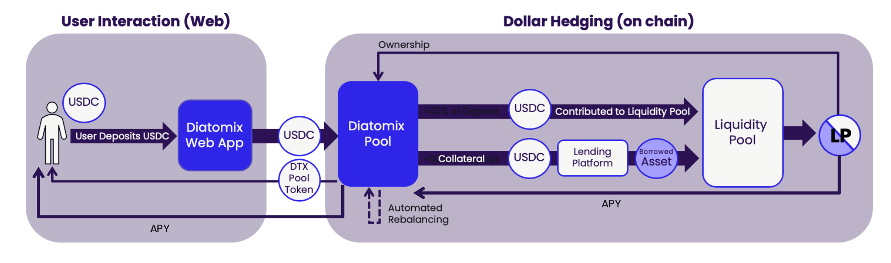
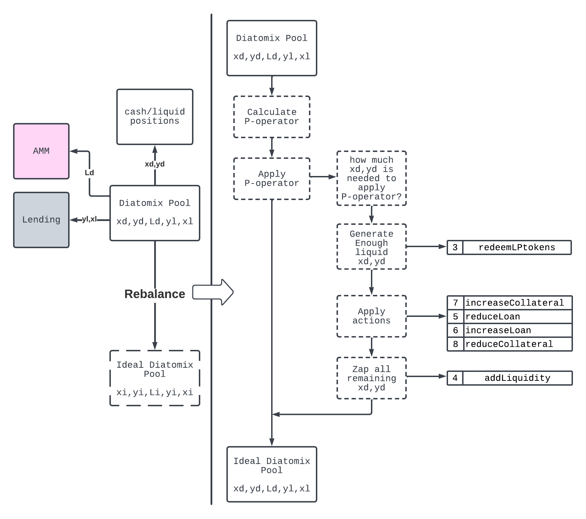

# Diatomix V1 - Value hedging solution to reduce downside risk

This hardhat project manages the upgradeable smart contracts for Diatomix V1

## How it works
A borrowed asset is used to provide the paired token to a liquidity pool. This reduces the exposure to the second asset in the pool and protects against market risks. Automatic rebalancing occurs when markets change to minimize downside risk.



### Pool Rebalancing
The hedged pool needs to rebalance according to certain conditions. A detailed explanation can be found in the corresponding document on the rebalancing algorithm. It follows the following procedure:




## Installation instructions

Clone the project, cd into it, and run:

```shell
npm install
```

The contracts can be found in the folder `contracts/`. Pool.sol is the main contract for the pooled version where the users deposits a token in the pool, part of this token is added as collateral to Aave, a loan is taken and then liquidity is added to Uniswap.

The pool rebalances after every action, while additionally chainlink Automation triggers the rebalancing function on long intervals.
ERC-2612 allows for gassless deposits into the pool with EIP-20 Signed Approvals, combined with OpenZeppelin Defender.

# Testing
Testing can be done with
`npx hardhat test`

The test environment uses a forked testnet on the local machine. In this way we have access to the uniswap and aave contracts.

### Compile the contracts & deploy to a testnet

To compile the contracts run:

```shell
npx hardhat compile
```

Before deploying the contracts to a testnet, update the constants values (Marketplace fees, addresses, etc) at the top of the file in `scripts/testing/deployAllContracts.ts`. To deploy and verify the contracts in the Polygon Mumbai testnet run

```shell
npx hardhat --network goerli run scripts/testing/deployFactory.ts
```